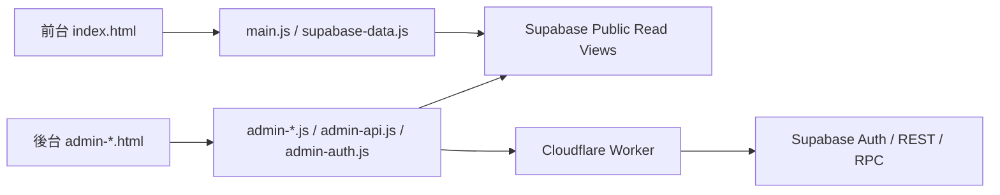

# 專案總覽

## 專案定位

`alpine-lang-learning-app` 是一個以詞彙學習為核心的 Web 應用，現階段主要包含兩個面向：

- 前台學習介面
  - 供一般使用者瀏覽字詞、切換顯示語言、播放音檔、查看圖片、收藏與篩選
- 後台管理介面
  - 供管理員登入後維護字詞、標籤與媒體引用，並查看簡易統計

它不是傳統 SPA 框架專案，也不是完整後後分離的大型系統，而是：

- 前台：單一頁面 `index.html` + Alpine.js 狀態管理
- 後台：多個獨立 HTML 頁面 + 共用 admin JS 模組
- 資料來源：Supabase
- 受保護寫入：Cloudflare Worker

---

## 技術組成

### 前端

- HTML
- CSS
- Alpine.js
- Tailwind CDN 設定
- Supabase JavaScript SDK

### 後端與資料

- Supabase Database
- Supabase Auth
- Supabase REST / RPC
- Cloudflare Worker

### 測試

- Node 內建 test runner
- Playwright

---

## 專案結構解析

### 根目錄主要檔案

- `index.html`
  - 前台唯一入口
- `admin-login.html`
  - 後台登入頁
- `admin-dashboard.html`
  - 後台總覽
- `admin-words.html`
  - 字詞清單
- `admin-word-edit.html`
  - 字詞新增 / 編輯
- `admin-assets.html`
  - 媒體引用檢視
- `admin-tags.html`
  - 標籤管理
- `package.json`
  - 只維護測試相關腳本與 Playwright 依賴
- `wrangler.jsonc`
  - Cloudflare Worker 部署設定

### `public/assets/js`

- `main.js`
  - 前台主程式，整個前台應用幾乎都在這裡
- `supabase-config.js`
  - Supabase URL、publishable key、admin login API URL
- `supabase-data.js`
  - 前台資料抓取與資料正規化
- `admin-auth.js`
  - 後台登入、session、admin 權限檢查
- `admin-api.js`
  - 後台讀寫 API 抽象層
- `admin-shell.js`
  - 後台共用 sidebar / page shell
- `admin-i18n.js`
  - 後台中英文切換
- `admin-dashboard.js`
  - dashboard controller
- `admin-words.js`
  - words 清單 controller
- `admin-word-edit.js`
  - word 編輯頁 controller
- `admin-assets.js`
  - assets 頁 controller
- `admin-tags.js`
  - tags CRUD controller
- `admin-login.js`
  - login 頁 controller

### `public/assets/css`

- `main.css`
  - 前台樣式
- `admin.css`
  - 後台樣式

### `supabase`

- `migrations`
  - Schema 與寫入支援的遷移腳本
- `seed.sql`
  - 初始資料

### `workers`

- `admin-auth-worker.js`
  - 管理員登入 API 與後台保護寫入 API

### `local-tests`

- 前台資料層測試
- 後台模組測試
- Worker 測試
- E2E runner

---

## 整體架構圖

這個架構有幾個關鍵設計意圖：

- 前台資料讀取盡量簡單，直接吃公開 read model
- 後台讀取也可直接讀，但寫入要經過 Worker
- Worker 使用 service role 與 RPC 做保護寫入
- 前後台都依賴同一套 Supabase schema

---

## 執行模型

### 前台

- 使用者開 `index.html`
- 載入 Alpine.js、Supabase SDK 與前台腳本
- `main.js` 內的 `lexiconApp()` 啟動
- `init()` 呼叫資料載入流程
- 從 Supabase view 抓語言、字詞、標籤、UI 翻譯
- 在前端完成資料正規化、過濾、排序、切換語言與播放音檔

### 後台

- 使用者先進 `admin-login.html`
- 輸入使用者名稱與密碼
- 瀏覽器向 Worker 發出登入請求
- Worker 驗證帳號、以 Supabase Auth 建 session
- 瀏覽器把 session 寫入 Supabase client
- 其他 `admin-*.html` 頁面使用 `admin-auth.js` 驗證 session 與 admin 身分
- 後台讀取可走 Supabase read model
- 後台寫入走 Worker 的 protected API

---

## 專案目前成熟度判斷

### 已成熟或至少成形的部分

- 核心資料表與 read model
- 前台字詞學習主流程
- 後台登入與權限檢查
- 字詞 / 標籤的基本 CRUD 支援
- Dashboard 與資產引用頁的基本資料聚合
- 基本測試體系

### 仍屬早期階段的部分

- UI 文案品質與一致性
- 檔案編碼治理
- 後台 upload / delete 的完整媒體管理
- 更完整的角色權限與審計
- 前台模組切分
- 環境設定與部署文件

---

## 開發者第一次接手時最容易踩到的點

1. 以為這是 React/Vue 專案
   - 不是，狀態與畫面邏輯大量集中在原生 JS + Alpine

2. 以為後台寫入可以直接從瀏覽器打資料表
   - 不是，目前設計上要經過 Worker

3. 以為 `seed.sql` 可以直接代表資料品質
   - 不完全成立，部分中文內容存在編碼問題

4. 以為後台所有頁面都是共用單一路由
   - 不是，後台是多頁 HTML，切頁即重新載入

5. 以為 `main.js` 只是小型控制器
   - 不是，它是前台核心應用本體，已超過一千行

---

## 專案目前最重要的三條主線

### 1. 詞彙資料主線

- `words`
- `word_translations`
- `tags`
- `word_tags`

這條主線決定前台顯示內容，也決定後台主要維護對象。

### 2. UI 翻譯主線

- `languages`
- `ui_translations`
- `main.js` 的 `t(key)`
- `admin-i18n.js`

這條主線決定前台與後台多語系能力。

### 3. 管理權限主線

- Supabase Auth
- `admin_users`
- `admin_accounts`
- `admin-auth.js`
- `admin-auth-worker.js`

這條主線決定誰能進入後台、如何登入、哪些寫入被允許。
