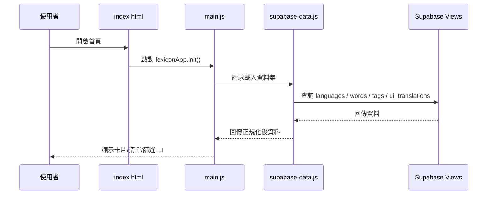

# 前台應用架構

## 入口與初始化

前台入口是 `index.html`。

這個頁面會載入：

- Tailwind CDN
- Alpine.js CDN
- Supabase SDK
- `public/assets/js/supabase-config.js`
- `public/assets/js/supabase-data.js`
- `public/assets/js/main.js`
- `public/assets/css/main.css`

`body` 上使用了：

```html
x-data="lexiconApp()"
x-init="init()"
```

這代表整個前台畫面幾乎都掛在 `main.js` 內的 `lexiconApp()` Alpine component。

---

## `main.js` 的角色

`public/assets/js/main.js` 是目前前台最核心、也最需要注意的檔案。它大約超過一千行，實際上承擔了：

- 前台狀態容器
- 初始化流程
- 使用者偏好保存
- 語系切換
- 卡片模式與清單模式
- 搜尋與篩選
- 收藏
- 音檔播放
- 文案翻譯
- 部分 UI 顯示規則

換句話說，這不是單純的 view helper，而是一個大型單檔前端應用。

---

## 前台狀態概念

依目前程式結構，前台至少管理以下幾類狀態：

### 載入狀態

- `loading`
- `error`
- 初始資料是否已完成取得

### 畫面模式

- `activeView`
  - `card`
  - `list`
  - 可能還有收藏與設定相關視圖切換

### 使用者偏好

- 母語 / 介面語言
- 顯示語言 1
- 顯示語言 2
- 卡片顯示偏好
- 其他 UI 設定

### 資料集合

- `words`
- `tags`
- `languages`
- `uiTranslations`

### 互動狀態

- 目前卡片索引
- 篩選條件
- 搜尋關鍵字
- filter panel 是否展開
- 收藏狀態

---

## 前台資料載入流程

資料不是直接散落在 `main.js` 內抓，而是透過 `supabase-data.js` 整理。

大致流程如下：



---

## `supabase-data.js` 的定位

`public/assets/js/supabase-data.js` 是前台與 Supabase read model 的接合層，主要責任是：

- 建立 Supabase client
- 查詢公開 view
- 把資料轉成前台較容易使用的格式

它讀取的核心 view 有：

- `lexicon_languages_api`
- `lexicon_words_api`
- `lexicon_tags_api`
- `lexicon_ui_translations_api`

這代表前台不是自己拼接多表 join，而是依賴資料庫先整理過的 view。

這個設計的好處：

- 前台邏輯較單純
- 讀取 schema 較穩定
- 減少前端對底層資料表的耦合

代價是：

- 一旦 view 欄位調整，前台和後台都要跟著調
- view 命名與欄位格式變成事實上的 API contract

---

## 字詞資料在前台的形狀

從 schema 與正規化流程推斷，一筆 word 最後大致會包含：

- `id`
- `img` 或 `image_url`
- 各語言文字
  - `lang_zh-TW`
  - `lang_id`
  - `lang_en`
- `pronunciation`
  - 以物件形式依語言存放
- `audio`
  - 以物件形式依語言存放
- `tags`
  - tag id 陣列

前台會再把它轉成更適合 UI 的資料，例如：

- 首選顯示文案
- 目前顯示語言對應文字
- 音檔可播放與否
- 缺圖 / 缺音狀態

---

## 多語系設計

前台多語系不是寫死在 HTML，而是走 `ui_translations` + `t(key)` 的模式。

`main.js` 內存在 `t(key, replacements = {})`，表示：

- 介面文字由 key 對應 value
- 可以有插值，例如 `{count}`
- 語系切換不只是資料內容，也包含 UI 文案

這種設計優點：

- 前台 UI 文案可資料化
- 新增語言時不一定要改前端程式

缺點：

- `ui_translations` 的資料品質會直接影響畫面
- 一旦 seed 或 DB 編碼有問題，整體 UI 會一起壞掉

---

## 前台主要使用者流程

### 1. 卡片學習模式

使用者進首頁後，預設通常會進入卡片模式。

這裡大致提供：

- 顯示主要文字
- 顯示次要語言文字
- 顯示發音
- 播放音檔
- 切到上一張 / 下一張
- 切換顯示語言

這是專案最核心的學習情境。

### 2. 清單模式

清單模式適合：

- 快速掃描所有字詞
- 查詢特定字詞
- 搭配標籤、圖片、音檔狀態篩選

### 3. 收藏 / 偏好設定

雖然這部分資料持久化方式偏前端本地狀態，但它代表產品已經不是單純只讀字卡，而是加入使用者自訂體驗。

---

## 本地儲存與偏好

`main.js` 內有 `persistPreferences()`，表示使用者設定會被保存到本地。

推測會存的資訊包括：

- 介面語言
- 顯示語言組合
- 可能的檢視偏好
- 收藏相關狀態

這種做法的優點：

- 不需要登入也能保留體驗

限制：

- 不會跨裝置同步
- localStorage 清掉就消失

---

## 前台的優勢與限制

### 優勢

- 架構輕量
- 沒有 bundler 壓力
- 上手成本低
- 靜態站部署容易

### 限制

- `main.js` 過大，後續擴充成本變高
- 狀態與 UI strongly coupled
- 型別保護不足
- 當需求再增加，維護風險會比框架化專案高

---

## 適合的重構方向

如果未來要持續擴充前台，建議優先做這幾件事：

1. 把 `main.js` 拆成多個模組
   - data loader
   - preferences
   - card view logic
   - list filtering
   - i18n
   - audio handling

2. 建立更清楚的資料型別契約
   - 即使不導入 TypeScript，也至少可以整理 JSDoc 或 schema 註解

3. 把 UI 字串來源與 fallback 策略寫清楚
   - 避免資料庫翻譯缺字時難除錯

4. 將測試集中在高風險互動邏輯
   - 尤其是篩選、卡片順序、語言切換、音檔策略
