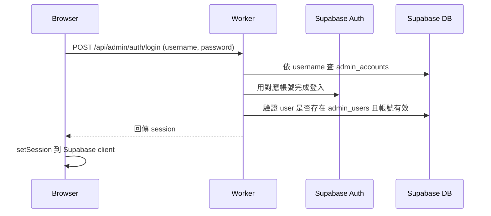
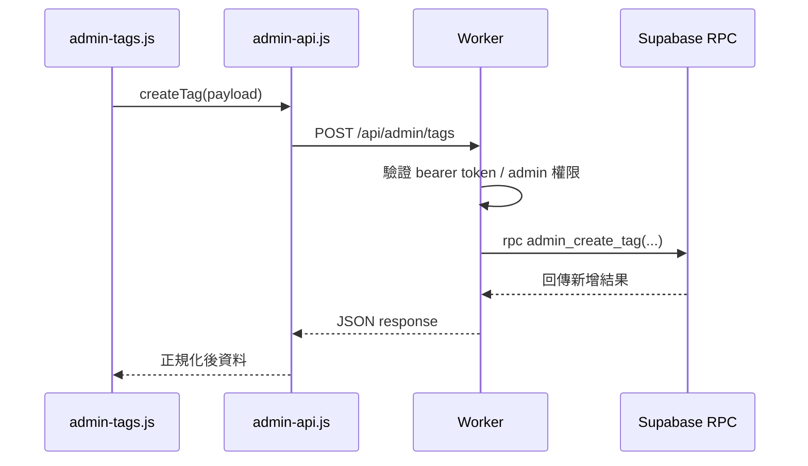

# Cloudflare Worker 與認證寫入流程

## Worker 的定位

`workers/admin-auth-worker.js` 是這個專案後台安全模型的核心。

它不是做整個網站 API，而是專門處理：

- 管理員登入
- admin 寫入 API
- 部分後台聚合讀取 API
- CORS 與授權驗證

它部署為獨立的 Cloudflare Worker，對外提供 `/api/admin/*` 路由。

---

## 為什麼需要 Worker

如果只有 Supabase public read model，前台可以直接讀。

但後台寫入若直接由瀏覽器完成，會遇到幾個問題：

1. 不能把 service role key 放到前端
2. 瀏覽器端很難安全地控制管理員寫入範圍
3. 認證流程需要一層 server-side 檢查
4. 想以 RPC 做寫入時，需要一個可安全持有高權限憑證的執行端

Worker 正是為了解決這件事存在。

---

## Worker 設定

`wrangler.jsonc` 目前可看到的設定重點：

- Worker 名稱：`alpine-lang-learning-app-admin-auth`
- 主程式：`workers/admin-auth-worker.js`
- `SUPABASE_URL`
- `ADMIN_API_BASE_PATH`
  - 預設 `/api/admin`
- `ADMIN_ALLOWED_ORIGIN`
  - 目前包含：
    - `http://127.0.0.1:5500`
    - `https://twkhjl.github.io`

這表示：

- 本地 Live Server 可直接打遠端 Worker
- GitHub Pages 站點也被允許

---

## CORS 模型

Worker 內有：

- `normalizeOrigin`
- `getAllowedOrigin`
- `createCorsHeaders`

其設計重點是：

- 只接受設定中允許的 origin
- preflight `OPTIONS` 要正確回應
- 實際 API 回應也要帶對應 `access-control-allow-origin`

這部分在本地測試很重要，因為後台頁面常常會以 `127.0.0.1:5500` 開啟。

---

## 管理員登入流程

後台登入不是單純前端 call `supabase.auth.signInWithPassword(email, password)`。

目前邏輯大致如下：

這個模型的重點在於：

- 對外暴露的是 username，不是 email
- Worker 可以決定哪些帳號屬於 admin
- 瀏覽器最後持有的是 Supabase session，而不是 Worker 自訂 token

---

## Worker 內的重要函式分工

從 `admin-auth-worker.js` 可觀察到幾個重要區塊：

### 輸入與安全輔助

- `getRequiredConfig`
- `getBearerToken`
- `normalizeWordPayload`
- `normalizeTagPayload`

### 與 Supabase 溝通

- `callAdminRpc`
- 各種 service role header 建立

### admin API 邏輯

- `handleAdminDashboardRead`
- `handleAdminTagCreate`
- `handleAdminTagUpdate`
- `handleAdminTagDelete`
- `handleAdminApiRequest`

### 認證與帳號解析

- `resolveAuthenticatedUser`
- `requireAdminApiAccess`
- `resolveAdminAccount`
- `resolveAdminUser`
- `handleLogin`

### 入口

- `handleRequest`

整體上，這個 Worker 其實已經具備一個小型 BFF 的角色。

---

## 寫入流程

以「新增標籤」為例：

對字詞新增 / 修改也是類似流程，只是 RPC 換成 word 相關函式。

---

## 錯誤處理策略

目前 Worker 會將錯誤包成 API error response。

近期修正後的一個重要差異是：

- server error 不再一律只回泛用訊息
- 會盡量帶出 `message` 與 `details`

這對除錯很有價值，例如：

- 可直接看出是 sequence 主鍵衝突
- 可直接看出 payload validation 問題

但對正式產品來說，也要注意：

- 是否會暴露過多內部錯誤訊息

開發期這樣做是合理的，正式環境則可能需要分級。

---

## Worker 與資料庫的耦合方式

Worker 並不是直接用 SQL 字串對資料表 CRUD，而是主要依賴：

- Supabase REST
- RPC function

這有幾個好處：

- 商業規則集中在 DB function
- Worker 比較像 transport / auth / error adapter
- 日後若前端 contract 不變，內部表結構仍可調整

但也形成以下耦合：

- RPC 名稱不能亂改
- payload shape 不能無聲調整
- Worker、migration、`admin-api.js` 三邊必須同步

---

## 部署與線上行為注意點

這個 Worker 的常見故障模式大致有三種：

1. 沒部署最新版本
   - 前端已呼叫新路由，但線上 Worker 沒有該 endpoint
   - 常見結果：`OPTIONS` 或 `POST` 404

2. `ADMIN_ALLOWED_ORIGIN` 不包含本地 origin
   - 常見結果：CORS preflight 失敗

3. DB migration 沒同步
   - 常見結果：Worker 有路由，但 RPC 或資料表行為不一致，導致 500

因此實務上每次改後台寫入邏輯時，至少要同時檢查：

- Worker 是否部署
- migration 是否套用
- 本地 origin 是否允許

---

## 目前 Worker 架構的優點

- 責任明確
- 風險邊界清楚
- 比把所有寫入放前端安全得多
- 適合中小型後台的 serverless 模式

---

## 目前 Worker 架構的限制

- 測試與除錯需要同時理解前端、Worker、Supabase
- 若 endpoint 逐漸變多，單檔 Worker 會變得笨重
- 缺少更完整的觀測性，例如 structured logs 或 metrics

---

## 建議的後續演進

1. 把 route handler 再拆模組
2. 建立更一致的 error code 表
3. 區分開發與正式環境錯誤訊息揭露策略
4. 將部署與 migration 流程文件化
